# EXCEL - VBA 

> visual basic application --> VBA

## 写在开头

### 课时

|     时间     |   地点    | 时长  |     人      |
| :----------: | :-------: | :---: | :---------: |
| 14::00-15:00 | ERP研究所 | 1hour | 郑,张,温,衣 |
|              |           |       |             |
|              |           |       |             |


### 网上的文档

[w3school]( https://www.w3cschool.cn/excelvba/ )

### 记笔记的软件

[typora]( https://www.typora.io/ )


### 文档约定

|          符号           |       意义       | 备注 |
| :---------------------: | :--------------: | :--: |
|         :happy:         | 表示vb的语法相关 |      |
|        :warning:        | 过程中出现的警告 |      |
|      :red_circle:       | 过程中出现的错误 |      |
|        :hammer:         |      小技巧      |      |
| :ballot_box_with_check: |     解决方案     |      |
|                         |                  |      |
|                         |                  |      |
|                         |                  |      |
|                         |                  |      |


## 环境搭建

#### 打开开发工具

##### 1. 文件


##### 2. 选项

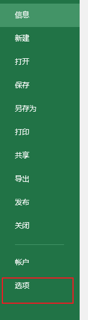

##### 3. 自定义功能区

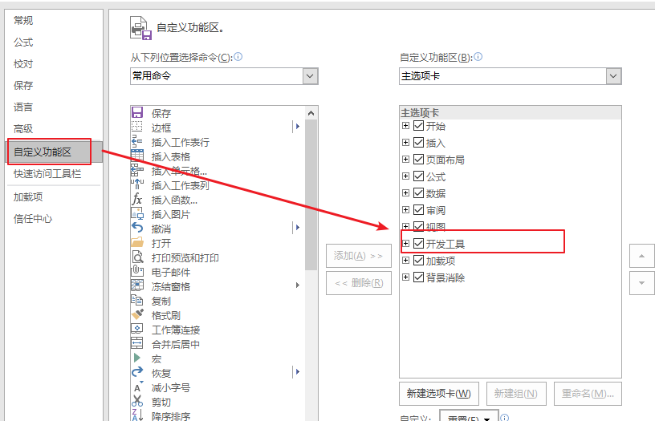


##### 4. 完成


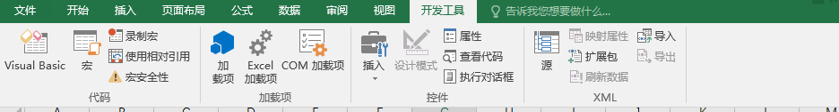


##### 5. 完整演示

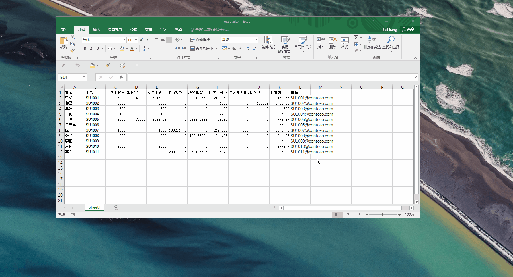


### 启用宏

#### 1. 文件

#### 2. 选项

#### 3.信任中心 -> 信任中心设置

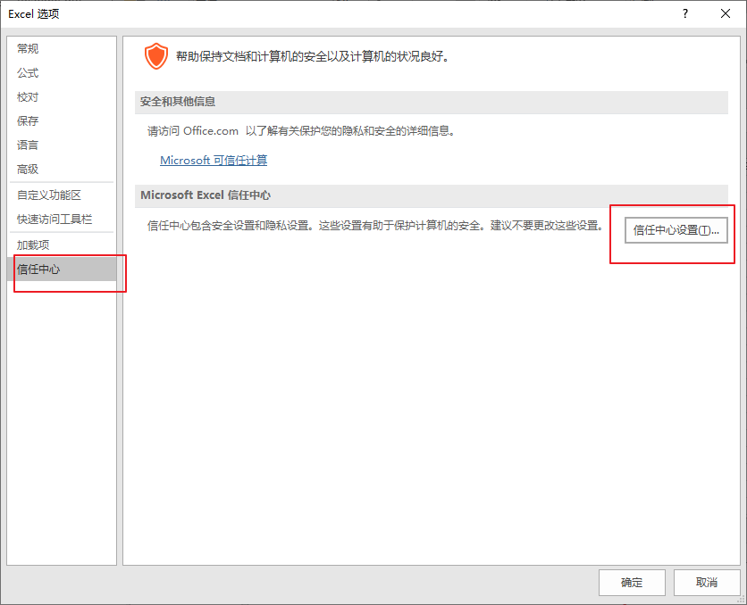

#### 4. 宏设置->启用所有宏

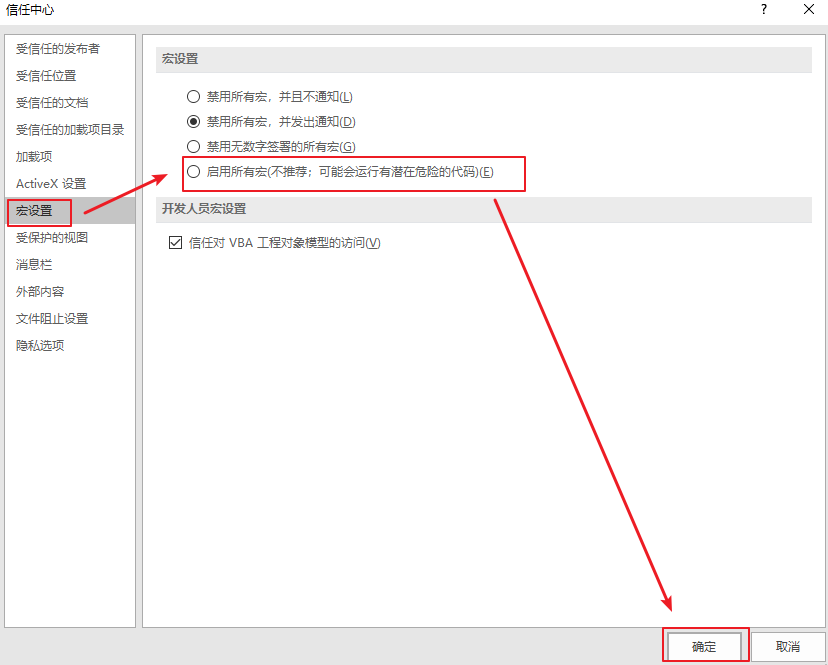


#### 5. 完整演示

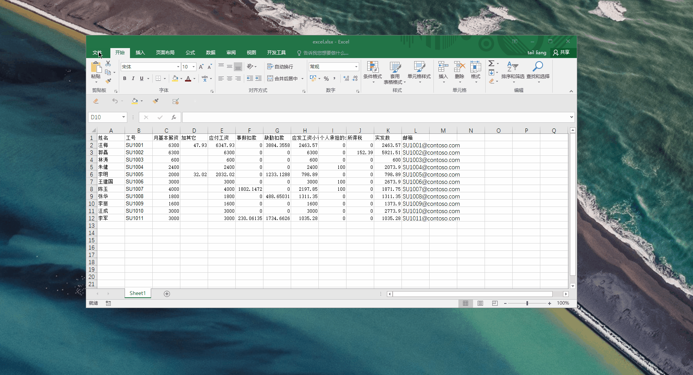


## 一个案例学习VBA基础

+ 工资条案例

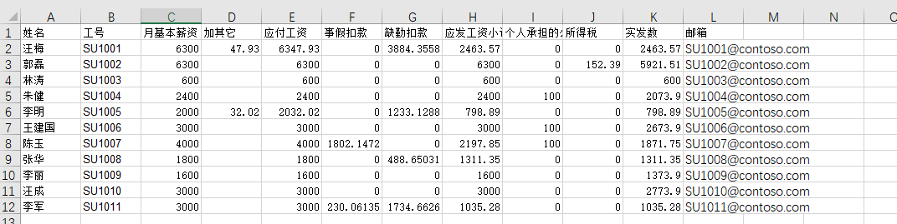


### 辅助工具--录制宏

> 用于不常用功能或者复杂功能的代码书写
>
> 因为不常用的功能代码不知道怎么写,可以百度,也可以利用VBA的宏录制功能替代.

#### demo

> 所谓录制宏,相当于SAP的录屏功能.操作的每一步都会被记录下来.--所以不要乱点,想清楚步骤.
>
> 演示下获取把单元格变色的功能代码

+ 手工的操作步骤
  + 选中要变色的单元格
  + 变色


+ 录制宏

  1. 点击录制宏

     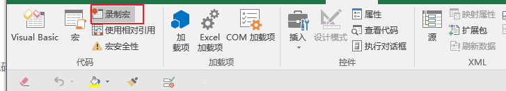

  2. 对宏取名->确定

     > 取名为change_color

     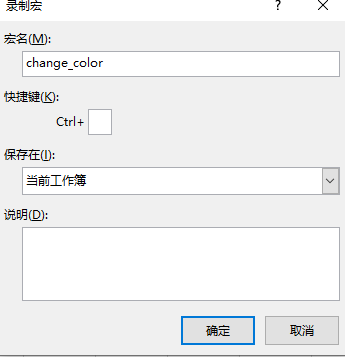

  3. 选中单元格

  4. 改颜色

     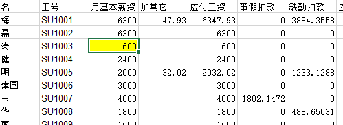

  5. 停止录制

  6. 查看生成的代码

     > 单击visual basic

     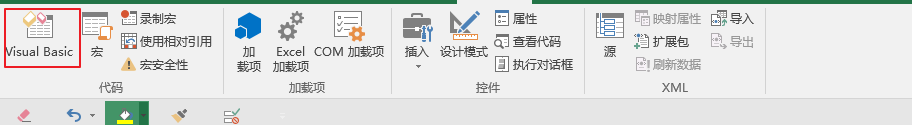

     > 模块->模块1

     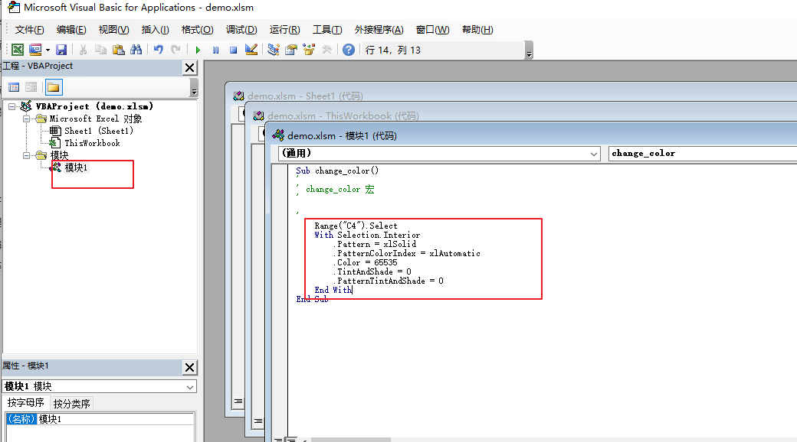

     > 代码

     ```vb
     Sub change_color()
     '
     ' change_color 宏
     '
     
     '
         Range("C4").Select
         With Selection.Interior
             .Pattern = xlSolid
             .PatternColorIndex = xlAutomatic
             .Color = 65535
             .TintAndShade = 0
             .PatternTintAndShade = 0
         End With
     End Sub
     
     ```

  7. 完整实例

     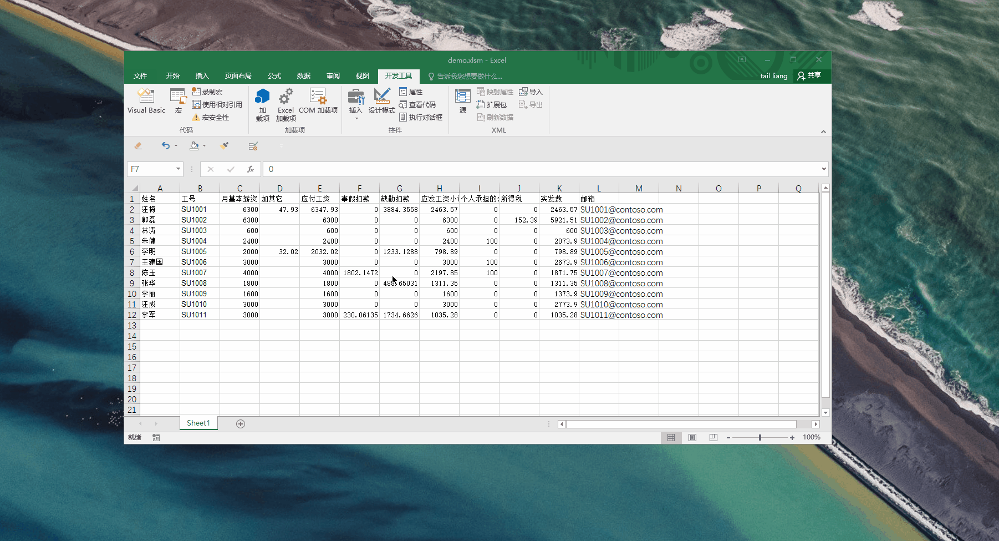


## 语法

###  :happy: 宏代码的结构

```vb
Sub 宏名()

    
End Sub
```

###  :happy: 定义变量

```vb
dim counter as Integer 
```


###  :happy: 循环

```vb
dim counter as Integer 
For counter = 1 To 5 step 2
'循环体
next

```


### :happy: 判断

```vb
If 条件1 Then
	条件1为真时要执行的语句
ElseIf 条件2 Then
	条件2为真时要执行的语句
ElseIf 条件3 Then
	条件3为真时要执行的语句
ElseIf 条件N Then
	条件N为真时要执行的语句
Else
	所有条件都为假时要执行的语句
End If
```


### :happy:常见对象/属性

> 所谓对象就是干活的人.你有一件事你不会做,你要指定一个会做的人去做,这个人就是对象.

+ ActiveCell
  + 插入公式
  + 
+ 


### 制作工资条

> 要将第一行的entry复制到第一行一下的每一行

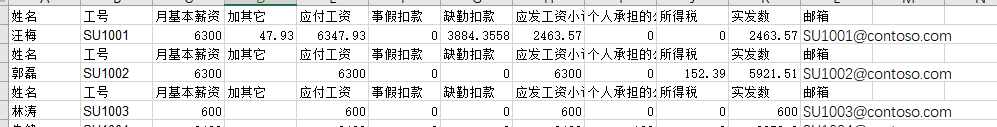

​	

:question:如何实现

> 首先手工可以完成,但是效率太低.如果员工人数过多,那浪费太多的时间

+ 分解步骤
  + 选中第一行,复制
  + 插入复制的行
  + 循环做10次

+ 使用录制宏->找到每个子功能

  + 选中第一行,复制

    ```vb
     Rows("1:1").Select
     Selection.Copy
    ```

    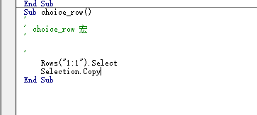

  + 插入复制的行--> 使用**相对引用**

    ```vb
    ActiveCell.Offset(-6, 0).Rows("1:1").EntireRow.Select
    Selection.Copy
    ActiveCell.Offset(2, 0).Rows("1:1").EntireRow.Select
    Selection.Insert Shift:=xlDown
    ```

  + :happy: 循环

    ```vb
    dim counter as Integer 
    For counter = 1 To 5 step 1
    '循环体
    next
    
    ```

  + :happy: 完整代码

    ```vb
    
    Sub gzt()
        ' 生成工资条
        Dim i As Integer ' 定义变量
    
        Rows("1:1").Select '选择第一行
        ' 循环
        For i = 1 To 10
            Selection.Copy
            ActiveCell.Offset(2, 0).Rows("1:1").EntireRow.Select
            Selection.Insert Shift:=xlDown
        Next
    
    End Sub
    ```

  + :warning: 宏执行完不可撤销-->所以我们先将数据备份

    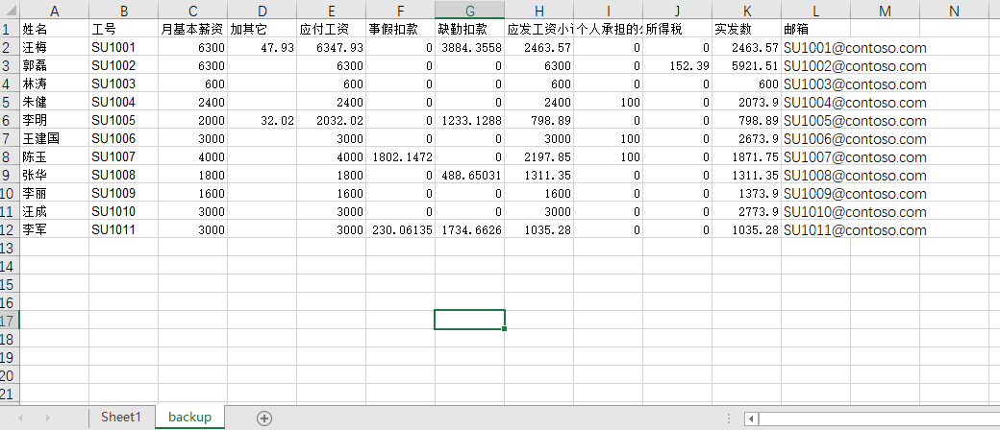


## 警告或者错误解决

### :warning: 文档检查器

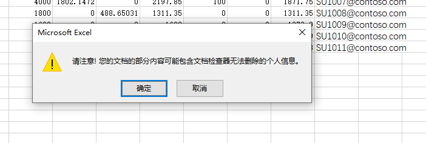

#### :ballot_box_with_check: 解决

[解决方案]( https://jingyan.baidu.com/article/7908e85cd88ce3af481ad2ad.html )


### :warning: 无法在未启用宏的工作簿中保存

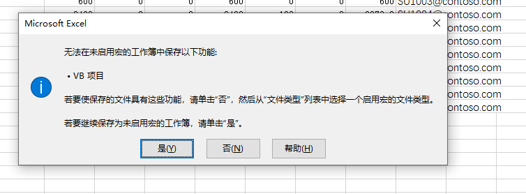

### :ballot_box_with_check: 解决

+ 点否

+ 出现保存对话框

  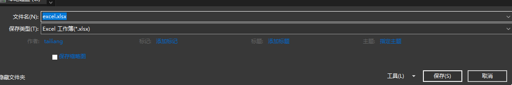

+ 选择启用宏的工作簿

  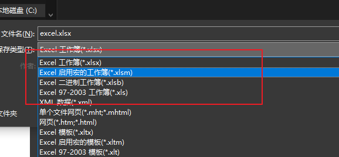


+ 出现感叹号

  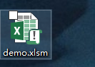

+ 打开这个文件即可

## EXCEL常用


### :hammer: 菜单下拉

1. 选择需要有菜单下拉的单元格
2. 数据->数据验证->验证条件(允许:序列,来源:用逗号隔开选项)即可

